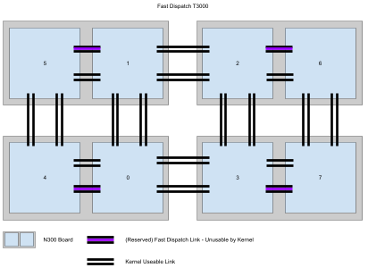
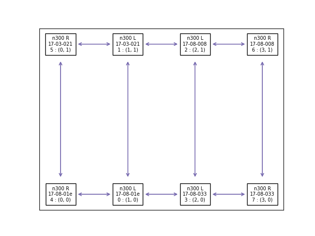
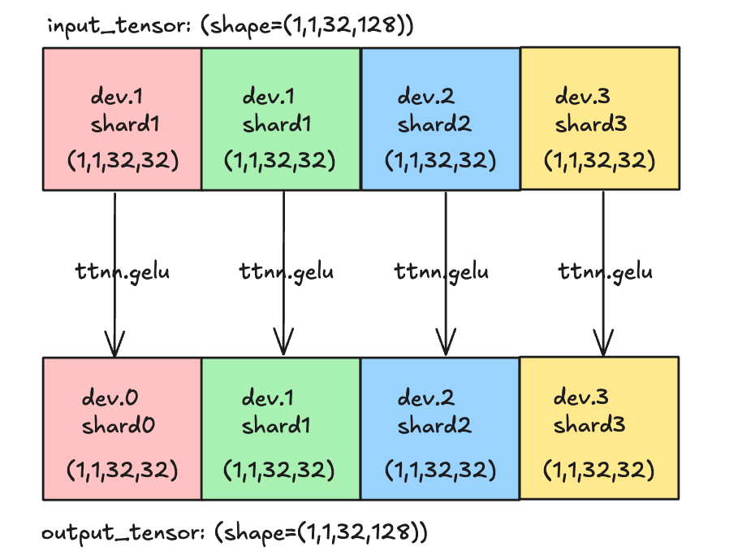

# Programming Mesh of Devices with TT-NN {#programming-mesh-of-devices-with-tt-nn}

Author: Joseph Chu

# Table of Contents {#table-of-contents}

[Programming Mesh of Devices with TT-NN](\#programming-mesh-of-devices-with-tt-nn)

[Table of Contents](\#table-of-contents)

[1\. Overview](\#1.-overview)

[2\. MeshDevice](\#2.-meshdevice)

[2.1 System Topology](\#2.1-system-topology)

[2.2 MeshDevice Management](\#2.2-meshdevice-management)

[2.2.1 MeshDevice Initialization/Close](\#2.2.1-meshdevice-initialization/close)

[2.2.1 MeshDevice Visualization](\#2.2.1-meshdevice-visualization)

[3\. Distributing Tensor to MeshDevice](\#3.-distributing-tensor-to-meshdevice)

[3.1 Distribution Strategies](\#3.1-distribution-strategies)

[3.2 Programming Example: Sharding](\#3.2-programming-example:-sharding)

[4\. Single-Program Multiple Device](\#4.-single-program-multiple-device)

[4.1 Execution Model](\#4.1-execution-model)

[4.2 Single Device to Multiple Device Execution](\#4.2-single-device-to-multiple-device-execution)

[4.2.1 Single Device Execution](\#4.2.1-single-device-execution)

[4.2.1 Mesh Device Execution](\#4.2.1-mesh-device-execution)

[5\. Programming Mesh of Devices Using Data Parallel](\#5.-programming-mesh-of-devices-using-data-parallel)

[5.1 Data Parallel Programming Example:](\#5.1-data-parallel-programming-example:)


##

## 1\. Overview {#1.-overview}

TT-NN library natively supports multi-device operations, enabling users to scale their single-device application code to multiple devices seamlessly. TT-NN employs a Single-Program Multiple-Device (SPMD) technique to parallelize a computation across a set of connected devices operating on different input data. This is achieved through a few key components:

- **MeshDevice**: This “virtual device” abstraction defines a logical 2-D mesh of connected physical devices. Operations that “run on device” are distributed through SPMD across all devices captured in the mesh.

- **Input Data Distribution**: Defines how input data resident in host-memory is distributed to DeviceMesh on-device memory. When operations are distributed to MeshDevice, the operation within a single-device scope works on its local input data.

- **Tensor**: Defines a N-dimensional matrix containing elements of a single data type. In a MeshDevice context, a Tensor, or colloquially referred to as MeshTensor, represents a collection of tensor shards distributed across devices in a 2D Mesh.


These concepts are key to understanding how we scale models using **Data-Parallel**, **Tensor-Parallel**, and **Hybrid Data \+ Tensor Parallel.**

##

## 2\. MeshDevice

### 2.1 System Topology

A MeshDevice can be instantiated over a collection of physically connected devices. The supported configurations are N300 (1x2), T3000 (2x4), Galaxy (8x4).

With the N300 form-factor, it houses two wormhole chips. The host is connected to the “left” chip via PCIe and the “left” chip is connected to the “right” chip via two ethernet links. Each ethernet link has a 200 Gbps bi-directional bandwidth. For N300, one of the ethernet links connecting the “left” chip to the “right” chip is reserved for fast-dispatch. At the user-level, this means only a single ethernet link is made available for use. The N300 represents the smallest multi-device configuration that we can instantiate a MeshDevice over.

T3000 is composed of four N300 wormhole cards that are physically connected in a 2x4 mesh configuration.

<!-- {width=15 height=15} -->


*Figure 1: T3000 System Topology*


[tt-topology](https://github.com/tenstorrent/tt-topology) can be used to flash multiple wormhole cards on a system to a specific ethernet routing configuration (linear, ring, mesh) and used to visualize the organization of the chip layout.

<!-- {width=15 height=15} -->


*Figure 2: T3000 Chip Layout dumped from tt-topology*

###

### 2.2 MeshDevice Management

#### 2.2.1 MeshDevice Initialization/Close

Using an N300, we can instantiate a MeshDevice over 1x2 Wormhole devices:

```py
> import ttnn
> mesh_device = ttnn.open_mesh_device(ttnn.MeshShape(1,2))
> mesh_device
> <MeshDevice: 1x2 grid, 2 devices>
...
> ttnn.close_mesh_device(mesh_device)
```

####

#### 2.2.1 MeshDevice Visualization

```py
ttnn.visualize_mesh_device(mesh_device)
>
   MeshDevice(rows=1, cols=2):
┌───────────────┬───────────────┐
│  Dev. ID: 0   │  Dev. ID: 1   │
│    (0, 0)     │    (0, 1)     │
│               │               │
└───────────────┴───────────────┘
```

##

## 3\. Distributing Tensor to MeshDevice

### 3.1 Distribution Strategies

MeshDevice in TT-NN provides a flexible way to distribute data across multiple devices. The distribution is primarily handled through the use of "mesh mappers" when creating tensors.

There are two main types of distribution strategies:

1. **Sharding**: This distribution strategy splits the tensor along specified dimension(s) and distributes the parts across devices in the mesh. This is useful for cases where the model-parameters cannot fit on a single-device and instead each device stores a slice of the model weights.

2. **Replication**: This distribution strategy copies the entire tensor to all devices in the mesh. This is useful for parameters that need to be available on all devices, such as model weights.

###

### 3.2 Programming Example: Sharding

Let’s see how to split our data across two devices:

```py
import ttnn

# Open our 1x2 MeshDevice
mesh_device = ttnn.open_mesh_device(ttnn.MeshShape(1, 2))

# Initialize a torch tensor
torch_tensor = torch.zeros(1, 1, 32, 64)
torch_tensor[..., 0:32] = 1.0
torch_tensor[..., 32:64] = 2.0

# Convert to ttnn.Tensor; MeshTensor holds buffers to two shards in host-memory
mesh_tensor: ttnn.Tensor = ttnn.from_torch(
    torch_tensor,
    mesh_mapper=ttnn.ShardTensorToMesh(device_mesh, dim=3),
    layout=ttnn.TILE_LAYOUT,
)
```

Let’s inspect our ttnn.Tensor object. At this point, the data still resides in host-memory.

```py
> mesh_tensor
ttnn.Tensor([[[[ 1.00000,  1.00000,  ...,  1.00000,  1.00000],
               [ 1.00000,  1.00000,  ...,  1.00000,  1.00000],
               ...,
               [ 1.00000,  1.00000,  ...,  1.00000,  1.00000],
               [ 1.00000,  1.00000,  ...,  1.00000,  1.00000]]]], shape=Shape([1, 1, 32, 32]), dtype=DataType::FLOAT32, layout=Layout::TILE)
ttnn.Tensor([[[[ 2.00000,  2.00000,  ...,  2.00000,  2.00000],
               [ 2.00000,  2.00000,  ...,  2.00000,  2.00000],
               ...,
               [ 2.00000,  2.00000,  ...,  2.00000,  2.00000],
               [ 2.00000,  2.00000,  ...,  2.00000,  2.00000]]]], shape=Shape([1, 1, 32, 32]), dtype=DataType::FLOAT32, layout=Layout::TILE)

```

Let’s now transfer to device:

```py
> mesh_tensor = ttnn.to_device(mesh_tensor, device_mesh)
> mesh_tensor

device_id:0
ttnn.Tensor([[[[ 1.00000,  1.00000,  ...,  1.00000,  1.00000],
               [ 1.00000,  1.00000,  ...,  1.00000,  1.00000],
               ...,
               [ 1.00000,  1.00000,  ...,  1.00000,  1.00000],
               [ 1.00000,  1.00000,  ...,  1.00000,  1.00000]]]], shape=Shape([1, 1, 32, 32]), dtype=DataType::FLOAT32, layout=Layout::TILE)
device_id:1
ttnn.Tensor([[[[ 2.00000,  2.00000,  ...,  2.00000,  2.00000],
               [ 2.00000,  2.00000,  ...,  2.00000,  2.00000],
               ...,
               [ 2.00000,  2.00000,  ...,  2.00000,  2.00000],
               [ 2.00000,  2.00000,  ...,  2.00000,  2.00000]]]], shape=Shape([1, 1, 32, 32]), dtype=DataType::FLOAT32, layout=Layout::TILE)

```

We now see that the following:

- 32x32 chunk with elements of 1.0 is residing in Device 11 DRAM
- 32x32 chunk with elements of 2.0 is residing in Device 10 DRAM

We can also visualize this tensor distributed across our MeshDevice. The visualization will color devices that have shards resident to the device.

```py
ttnn.visualize_mesh_device(mesh_device, tensor=mesh_tensor)

>
                  DeviceMesh(rows=1, cols=2):
┌──────────────────────────────┬──────────────────────────────┐
│         Dev. ID: 11          │         Dev. ID: 10          │
│            (0, 0)            │            (0, 1)            │
│  ttnn.Shape([1, 1, 32, 32])  │  ttnn.Shape([1, 1, 32, 32])  │
└──────────────────────────────┴──────────────────────────────┘


```

## 4\. Single-Program Multiple Device

### 4.1 Execution Model

TT-NN uses a Single-Program Multiple-Device (SPMD) technique to parallelize computations across multiple devices. This approach allows the same computation to run on multiple devices simultaneously, each operating on different portions of the input data.

### 4.2 Single Device to Multiple Device Execution

#### 4.2.1 Single Device Execution

Let’s run a simple gelu operation on a single-device:

```py
# Open a single device
device = ttnn.open_device(0)

# Create test tensor of data
torch_tensor = torch.rand((1,1,32,32), dtype=torch.bfloat16)

# Convert to ttnn.Tensor, tilize and move onto device DRAM
ttnn_tensor = ttnn.from_torch(
    torch_input_tensor,
    layout=ttnn.TILE_LAYOUT,
    device=device,
)

# Execute operation on-device
output_tensor = ttnn.gelu(ttnn_tensor)
```

####

#### 4.2.1 Mesh Device Execution

```py
# Open MeshDevice
mesh_device = ttnn.open_mesh_device(ttnn.MeshShape(1,4))


# Create test tensor of data; 4 chunks of 32x32
torch_tensor = torch.rand((1,1,32,128), dtype=torch.bfloat16)

# Convert to ttnn.Tensor, tilize and move onto devices across mesh DRAM
ttnn_tensor = ttnn.from_torch(
    torch_input_tensor,
    layout=ttnn.TILE_LAYOUT,
    device=mesh_device,
)

# Invoke ttnn.gelu on each of the devices in the mesh
output_tensor = ttnn.gelu(ttnn_tensor)

```

<!-- {width=10 height=10} -->


*Figure 1: Parallel execution of gelu operation on 4 devices*

## 5\. Programming Mesh of Devices Using Data Parallel

This tutorial demonstrates how to convert a model running on a single-device to multiple devices using data-parallel strategy. Using data parallel can be a good strategy to scale to multiple devices when your model fits on a single-device.

At a high-level, using Data Parallel to scale performance to N-devices involves:

1. Shard the input activation data along the batch dimension into N-chunks
2. Replicate the model weights for each of the N-devices

Effectively, each device contains a replica of the model and is responsible for computing a shard of the final output tensor.

###

### 5.1 Data Parallel Programming Example:

Let's start by creating a simple MLP model in TT-NN on a single-device and scale to multiple devices by using data-parallel. We’ll use pretrained weights and compare against torch for validation:

1. **Create a TT-NN Falcon-7B MLP Module implementation**

```py
import ttnn

class TtFalconMLP:
    def __init__(self, parameters):
        super().__init__()
        self.dense_h_to_4h_weights = parameters.dense_h_to_4h.weight
        self.dense_4h_to_h_weights = parameters.dense_4h_to_h.weight

    def __call__(self, x: ttnn.Tensor) -> ttnn.Tensor:
        ff1_linear: ttnn.Tensor = ttnn.linear(x, self.dense_h_to_4h_weights)
        gelu = ttnn.gelu(ff1_linear)
        ff2_linear: ttnn.Tensor = ttnn.linear(gelu, self.dense_4h_to_h_weights)

        return ff2_linear
```

2. **Instantiate torch model for comparison**

```py
# Load Falcon MLP model from huggingface
config = transformers.FalconConfig.from_pretrained("tiiuae/falcon-7b-instruct")
model = transformers.models.falcon.modeling_falcon.FalconMLP(config).eval()
```

3. **Execute TT-NN Falcon-7B MLP Module on a single Tenstorrent Device**

```py

# Device Initialization
device = ttnn.open_device(0)

# Convert torch input activations to ttnn.Tensor and move to device

# Initialize hidden states
batch_size, sequence_length = 1, 128
torch_hidden_states = (torch.rand(batch_size, 1, sequence_length, config.hidden_size, dtype=torch.float32) * 2) - 1

hidden_states = ttnn.from_torch(torch_hidden_states, dtype=ttnn.bfloat16, layout=ttnn.TILE_LAYOUT, device=device)

# Preprocess model parameters: loop through model parameters, convert to ttnn tensors, and move to device
parameters = ttnn.model_preprocessing.preprocess_model_parameters(
    initialize_model=lambda: model,
    device=device,
)

# Initialize Model
ttnn_model = TtFalconMLP(parameters) # Initialize Model

# Run Model
ttnn_output = ttnn_model(hidden_states)

assert_with_pcc(
    torch_model.forward(torch_hidden_states),
    ttnn.to_torch(ttnn_output),
    0.98
)

ttnn.close_device(device)
```

4. **Executing TT-NN Falcon-7B MLP Module on MeshDevice with Data Parallel**

```py
# Load Falcon MLP model from huggingface
config = transformers.FalconConfig.from_pretrained("tiiuae/falcon-7b-instruct")
model = transformers.models.falcon.modeling_falcon.FalconMLP(config).eval()

# Initialize hidden states
batch_size, sequence_length = 4, 128
torch_hidden_states = (torch.rand(batch_size, 1, sequence_length, config.hidden_size, dtype=torch.float32) * 2) - 1
torch_output = model.forward(torch_hidden_states)

# Device Initialization
mesh_device = ttnn.open_device_mesh(ttnn.DeviceGrid(y=1, x=4))

# Shard input activations on batch dimension to devices in the mesh
with ttnn.distribute(ttnn.ShardTensorToMesh(mesh_device, dim=0)):
    hidden_states = ttnn.from_torch(
        torch_hidden_states,
        dtype=ttnn.bfloat16,
        layout=ttnn.TILE_LAYOUT,
        device=mesh_device,
    )

# Replicate model parameters to devices in the mesh
with ttnn.distribute(ttnn.ReplicateTensorToMesh(mesh_device)):
    parameters = ttnn.model_preprocessing.preprocess_model_parameters(
        initialize_model=lambda: model,
        device=mesh_device,
    )

# Initialize Model
ttnn_model = TtFalconMLP(parameters)
ttnn_output = ttnn_model(hidden_states)

with ttnn.distribute(ttnn.ConcatMeshToTensor(mesh_device, dim=0)):
    assert_with_pcc(torch_output, ttnn.to_torch(ttnn_output), 0.98)
```
